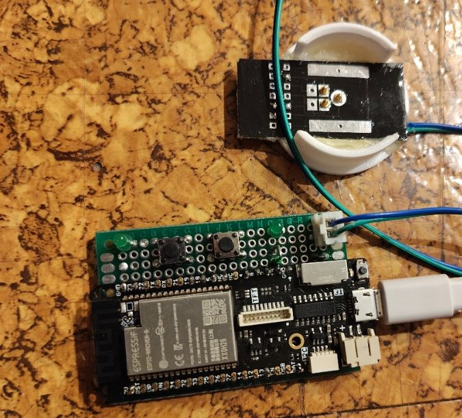
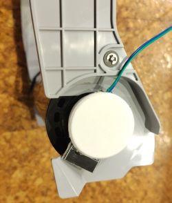

# DS2431GA

Arduino ESP32 sketch to read, write, back up and restore the DS2431 1-Wire EEPROM used as the ID chip on Sony UP-DR200 / UP-CR20L dye-sub ribbons (and compatible generic DS2431 chips). Controlled entirely over the serial console.



## Features

- Detect and identify a DS2431 (or Sony custom `0xAD`) EEPROM on the 1-Wire bus
- Read the 128-byte memory as hex or plain characters
- Erase the EEPROM or write arbitrary text to it
- Read/write the protection control and user bytes (0x80-0x86)
- Parse the Sony ribbon tag (part number, serial, batch, dates, prints remaining, capacity, ...)
- Set the remaining-prints counter directly (`a` command)
- Back up EEPROM contents to a SPIFFS file, restore from it, and dump it as hex or base64
- SPIFFS file management (directory listing, delete, format) from the serial console
- Status LEDs for chip detection and write activity, plus a slow-blink watchdog LED
- Two push buttons: short/long press handling (e.g. long-press reboot). Buttons are there for further use.

## Hardware

Developed and tested on a **LOLIN D32 PRO** (ESP32).

| Signal              | ESP32 default | Uno / other  |
|---------------------|:---:|:---:|
| DS2431 1-Wire data  | GPIO 4 | A4 |
| Chip-detected LED   | GPIO 13 | GPIO 13 |
| Write-activity LED  | GPIO 23 | GPIO 23 |
| Button 1            | GPIO 19 | GPIO 19 |
| Button 2            | GPIO 18 | GPIO 18 |

Connect the DS2431 data line to the configured 1-Wire pin with a pull-up resistor to 3V3 (ESP32) or 5V (Uno), and ground.

Pin numbers, button behaviour, and filesystem options are all configured in [settings.h](settings.h) — see below.
The schematics is [here](schematic/DS2431GA.png)

### Bill of materials

| Qty | Part |
|:---:|---|
| 1 | LOLIN D32 PRO (ESP32 board) |
| 2 | Low power LED |
| 2 | Resistor, 330 Ω |
| 1 | Resistor, 3k9 |
| 2 | Resistor, 1k2 |
| 2 | Universal PCB (one for the main board, one for the probe) |
| 3 | Pogo pin (for the probe) |
| 1 | JST 2-pin connector, pair (male + female) |



## Usage

Open the Serial Monitor at **115200 baud**. In VSCode set Line Ending to CR.  On boot the sketch mounts SPIFFS and prints the menu:

```
Menu:
  EEPROM:
    e - erase memory
    h - read memory as hexadecimal
    b - backup memory to SPIFFS file
    w - recovery memory from SPIFFS file
    t - read backup as hexadecimal
    u - read backup as base64 (for download)
    s - store base64 data as SPIFFS backup file
    x - read control bytes
    c - write chars
 Sony specific:
    a - write remaining prints
    o - parse Sony ribbon tag
    p - parse backup of Sony ribbon tag
 System:
    r - reboot
    d - Directory listing of SPIFFS filesystem
    f - format SPIFFS filesystem
    k - delete SPIFFS file
    m - print menu
```

Type the letter for a command and, if prompted, follow up with the requested value terminated by Enter (Esc or Ctrl+C cancels a pending command). Commands `w`, `t`, `p`, `u`, `k`, and `s` operate on files inside `/spiffs/backup` (or `/spiffs` for `k`) and print a directory listing to help you pick a filename.

The chip-detected LED lights whenever a DS2431 is present on the bus; the write LED lights during an EEPROM write; the built-in LED blinks slowly as a watchdog heartbeat.

## Settings (`settings.h`)

| Define | Purpose |
|---|---|
| `ONE_WIRE_MAX_DEVICE` | Maximum number of 1-Wire devices expected on the bus |
| `signalPin` | 1-Wire data GPIO (GPIO 4 on ESP32, `A4` otherwise) |
| `ledChipDetectPin` | LED lit while a DS2431 is detected on the bus |
| `ledWritePin` | LED lit while writing to the EEPROM |
| `button1Pin` / `button2Pin` | GPIOs wired to the two push buttons |

Uncomment/adjust the defines to match your board and desired behaviour before building.

## Building

Open `DS2431GA.ino` in the Arduino IDE (or use `arduino-cli`) and select an ESP32 or Arduino Uno board. Required libraries:

- `OneWire`
- `jled`
- `Bounce2`
- `mbedtls` (bundled with the ESP32 core)

## Credits

Based on code originally published in the Arduino forum thread [1-Wire EEPROM DS2431GA - unlock or factory reset](https://forum.arduino.cc/t/1-wire-eeprom-ds2431ga-unlock-or-factory-reset/960298).

## License

This project is released into the public domain under [The Unlicense](LICENSE) — do whatever you want with it.
